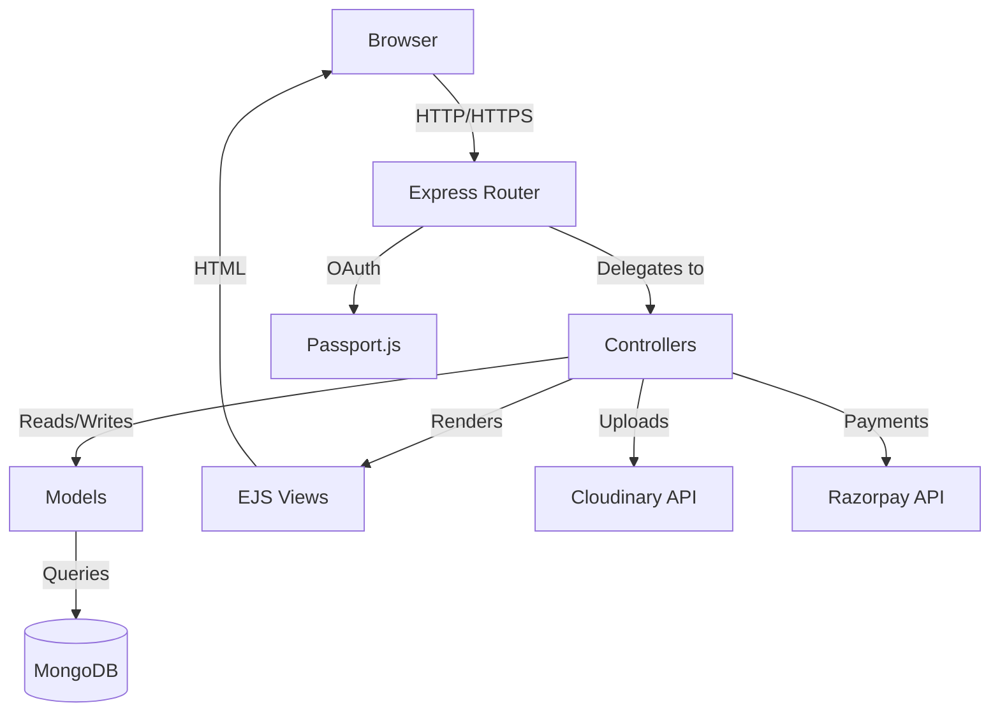
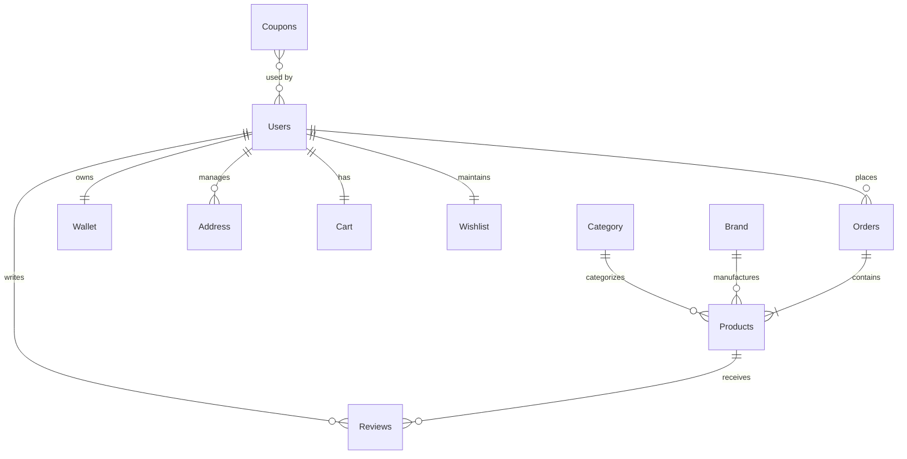

<div align="center">
  

  <h1>TimelessEdge</h1>
  
  <p><b>Enterprise-Grade Full Stack Luxury Watch E-Commerce Platform</b></p>

  <!-- Repository Statistics & Badges -->
  <a href="https://nodejs.org/"></a>
  <a href="https://expressjs.com/"></a>
  <a href="https://www.mongodb.com/"></a>
  <a href="https://github.com/Rahulph-2001/TimelessEdge/blob/main/LICENSE"></a>
  <a href="https://github.com/Rahulph-2001/TimelessEdge/commits/main"></a>
  <a href="https://github.com/Rahulph-2001/TimelessEdge/issues"></a>
</div>

<br/>

> **TimelessEdge** is a production-ready, high-performance digital storefront engineered for luxury horology. Built on a robust MVC architecture, it delivers a frictionless consumer experience while providing administrators with powerful tools for inventory, order, and financial management.

## Project Motivation
Building a luxury e-commerce platform requires absolute reliability, seamless payment integration, intuitive order management, and airtight security to maintain consumer trust. I built TimelessEdge to engineer an all-in-one scalable architecture from scratch, mastering real-world complexities like atomic wallet transactions, dynamic coupon engines, and secure payment webhooks without relying on out-of-the-box CMS solutions.

---

## Table of Contents

- [Overview](#overview)
- [Features](#features)
- [Tech Stack](#tech-stack)
- [Architecture](#architecture)
- [Database Diagram](#database-diagram)
- [Installation](#installation)
- [Environment Variables](#environment-variables)
- [Project Structure](#project-structure)
- [Security](#security)
- [API Overview](#api-overview)
- [Screenshots](#screenshots)
- [Deployment](#deployment)
- [Roadmap](#roadmap)
- [License](#license)
- [Author](#author)

---

## Overview

### The Problem
Many e-commerce solutions fail to provide an integrated wallet and advanced coupon engine out-of-the-box, forcing developers to rely on bloated plugins. They also often lack robust, role-based dashboards that can handle real-time sales analytics and complex ledger reporting.

### The Objective
TimelessEdge solves these challenges by providing a highly converting frontend experience paired with a data-driven Node.js backend. The architecture enforces strict separation of concerns, ensuring the codebase remains maintainable, testable, and highly extensible.

### Demo

The project includes seeded demo data for local testing.

To create demo users:
```bash
npm run seed
```
*Demo credentials are intentionally omitted for security.*

---

## Features

### Customer Features
- **Advanced Product Discovery:** Multi-faceted filtering (Price, Brand, Category) with robust search capabilities.
- **Unified Checkout:** Multi-address management, dynamic coupon validation, and multi-gateway payment routing.
- **Digital Wallet & Referrals:** Built-in digital ledger allowing users to store funds, receive refunds, and earn credits via unique referral links.
- **Account Management:** Comprehensive user dashboard for tracking order statuses, downloading invoices, and processing returns.

### Admin Features
- **Sales Analytics Dashboard:** Real-time metrics utilizing Chart.js to visualize revenue, order volume, and top-performing SKUs.
- **Dynamic Offer Engine:** System-wide capabilities to deploy percentage-based discounts on specific categories or individual products.
- **Coupon Management:** Create targeted promotional codes with strict minimum purchase and expiration constraints.
- **Ledger & Reporting:** Automated generation of financial reports exportable to PDF and Excel.

---

## Tech Stack

| Layer | Technology |
| :--- | :--- |
| **Backend** | Node.js |
| **Framework** | Express |
| **Database** | MongoDB |
| **ORM** | Mongoose |
| **Frontend** | EJS |
| **Authentication** | Passport.js |
| **Payment** | Razorpay |
| **Storage** | Cloudinary |
| **Email** | Nodemailer |

---

## Architecture



---

## Database Diagram



---

## Installation

### Prerequisites
- **Node.js:** `>= 20.x`
- **MongoDB:** `>= 7.x`

### 1. Clone the Repository
```bash
git clone https://github.com/Rahulph-2001/TimelessEdge.git
cd TimelessEdge
```

### 2. Install Dependencies
```bash
npm install
```

### 3. Start the Application
**Development Mode:**
```bash
npm run dev
```
**Production Mode:**
```bash
npm start
```

---

## Environment Variables

Create a `.env` file based on `.env.example`. **Never expose real credentials.**

### `.env.example`
```env
PORT=7500
MONGODB_URI=mongodb_connection_string
SESSION_SECRET=highly_secure_random_string

# Email Configuration (Nodemailer)
NODEMAILER_EMAIL=system_email@gmail.com
NODEMAILER_PASSWORD=app_specific_password

# Google OAuth
GOOGLE_CLIENT_ID=google_oauth_client_id
GOOGLE_CLIENT_SECRET=google_oauth_client_secret
CALLBACKURL=http://localhost:7500/auth/google/callback

# Cloudinary (Image Storage)
CLOUDINARY_CLOUD_NAME=cloudinary_cloud_name
CLOUDINARY_API_KEY=cloudinary_api_key
CLOUDINARY_API_SECRET=cloudinary_api_secret

# Razorpay (Payments)
RAZORPAY_KEY_ID=razorpay_key_id
RAZORPAY_KEY_SECRET=razorpay_key_secret
```

---

## Project Structure

```text
TimelessEdge/
├── config/             # Database connection, Passport strategies, Cloudinary setup
├── controllers/        # Business logic separated by domain (admin, user)
├── helpers/            # Utility functions (Multer config, Validators)
├── middlewares/        # Express middlewares (Auth guards, Error handlers)
├── models/             # Mongoose schemas (Users, Products, Orders, Wallet)
├── public/             # Static assets (Compiled CSS, Vanilla JS, Images)
├── routes/             # API routing definitions
├── scripts/            # Database seeding and migration utilities
├── views/              # EJS Server-side rendered templates
├── .env.example        # Environment variable template
├── app.js              # Application bootstrap and configuration
└── package.json        # Dependency management and scripts
```

---

## Security

Security is treated as a first-class citizen in this application:

- **Password Protection:** Passwords are securely hashed using bcrypt with salted hashing before being stored.
- **Session Management:** Secure, server-side session tracking prevents client-side tampering.
- **Authentication Guards:** Custom middleware (`userAuth`, `adminAuth`) intercept requests to protected resources.
- **Payment Verification:** Cryptographic HMAC SHA256 signature verification ensures payment callbacks from Razorpay are authentic and untampered.
- **Input Validation:** Strict server-side schema validations and data sanitization prevent NoSQL injection and malformed data persistence.

---

## API Overview

| Method | Endpoint | Purpose |
| :--- | :--- | :--- |
| `POST` | `/login` | User Login & Authentication |
| `POST` | `/signup` | Register new user account |
| `GET`  | `/shop` | Retrieve paginated and filtered product catalog |
| `POST` | `/cart/add` | Append item to user's cart |
| `POST` | `/checkout` | Validate cart and initiate checkout flow |
| `POST` | `/order/place` | Finalize order creation and wallet deduction |
| `POST` | `/order/verify-payment` | Validate Razorpay HMAC signature |
| `GET`  | `/admin/dashboard` | Retrieve analytics dashboard data |

---

## Screenshots

| Home | Shop | Product Details |
| :---: | :---: | :---: |
| *[Home Screenshot]* | *[Shop Screenshot]* | *[Product Details Screenshot]* |

| Cart | Checkout | Wallet |
| :---: | :---: | :---: |
| *[Cart Screenshot]* | *[Checkout Screenshot]* | *[Wallet Screenshot]* |

| Orders | Profile | Admin Dashboard |
| :---: | :---: | :---: |
| *[Orders Screenshot]* | *[Profile Screenshot]* | *[Admin Dashboard Screenshot]* |

| Analytics | Reports |
| :---: | :---: |
| *[Analytics Screenshot]* | *[Reports Screenshot]* |

---

## Deployment

TimelessEdge is designed to be easily deployable across modern cloud environments:

- **Local:** Node.js server with local or Atlas MongoDB.
- **Render / Railway:** Ready for PaaS deployments utilizing environment variables.
- **AWS EC2:** Can be deployed to a virtual private server using Nginx as a reverse proxy.
- **Docker:** (Upcoming) Containerized deployment for consistent environments.

---

## Roadmap

- Docker Support
- CI/CD Pipeline
- Redis Cache
- Elasticsearch
- Unit Testing
- Integration Testing
- AWS Deployment
- Kubernetes

---

## License

This project is licensed under the [MIT License](LICENSE).

---

## Author

**Rahul P H**

- 🌐 [Portfolio](#)
- 💼 [LinkedIn](#)
- 🐙 [GitHub](https://github.com/Rahulph-2001)
- ✉️ [Email](mailto:rahullph43@gmail.com)

---

<div align="center">
  <p>Engineered with precision. Built for scale.</p>
</div>
